# Marketing attribution via Bayesian forecasting

> **This is a portfolio demonstration built on synthetic data.**

Marketing teams need to know how much of a streaming lift a paid campaign actually caused, not just what moved after it ran, because that number decides how the next budget is spent. This builds the missing no-campaign counterfactual with a Bayesian structural time-series model fit on aggregated daily data alone, reads the causal effect as observed minus counterfactual with a full credible interval, and reconciles the per-region and total figures into one coherent set finance can trust. The payoff is a defensible, uncertainty-aware attribution number that survives a skeptical review and turns campaign spend into a decision rather than a guess.

**Live demo:** https://k1monfared.github.io/ad_attribution/ , an interactive seven-scenario explorer you can open in a browser.

## Outputs

### 1. Did the campaign for the growth-scenario artist work, and by how much?

Yes. The campaign lifted streams by 12.7%, with a 95% credible interval of 10.8%
to 14.5%. That is about 79K extra streams over the post-campaign window,
credible interval 68K to 89K.

How: a Bayesian structural time-series model is fitted to the pre-campaign period
and forecast forward to build the no-campaign counterfactual, then the effect is
the observed series minus that counterfactual, read off as the posterior lift
with its credible interval. The injected truth was 13.9%, which sits inside the
interval.

So what: the roughly 13% lift is a defensible, bankable number. Size the next
campaign against it rather than against the raw before-and-after change.

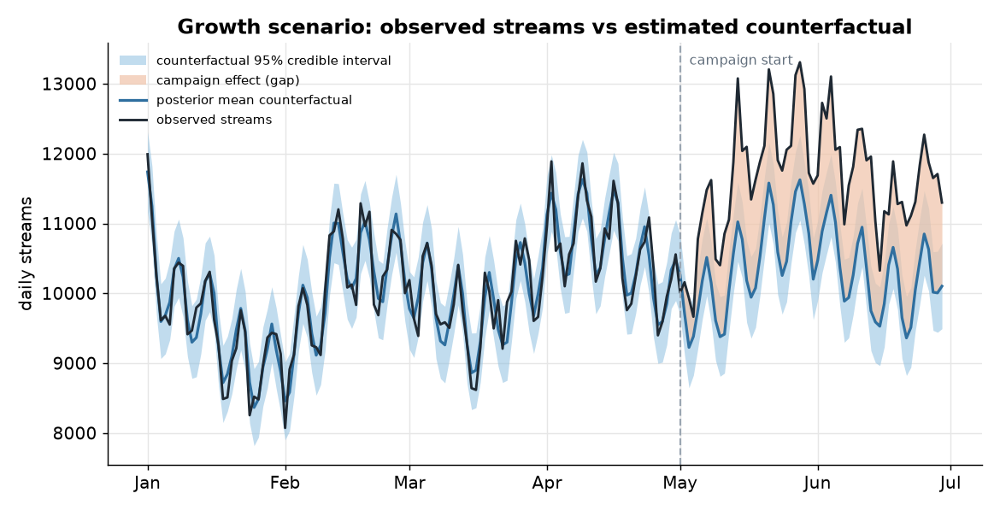

Observed streams against the posterior mean counterfactual, with the blue band as the 95% credible interval and the shaded gap as the estimated campaign lift.

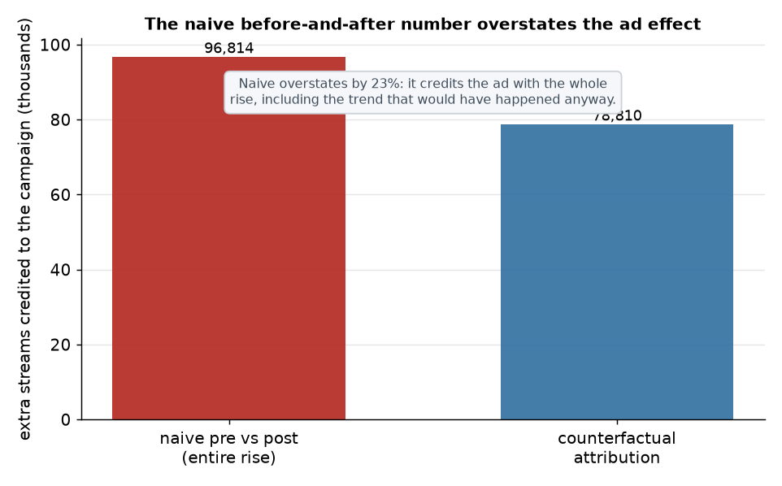

What a naive pre-versus-post read gets wrong: it credits the ad with the entire rise above the pre-campaign level, while the counterfactual attribution counts only the gap above the projected trend, so the naive number overstates the effect.

### 2. Streams are down versus last month. Did the ad still help?

Yes, materially. In the declining-catalog campaign the observed post-period runs
11.7% below the pre-campaign level, so at a glance it looks like a failure.
Against the no-campaign counterfactual it would have fallen 31.0%. The campaign
retained about 110K streams, credible interval 84K to 140K, a 28.1% lift
over the no-ad path.

How: the same Bayesian counterfactual, with the effect framed as decline avoided,
observed minus counterfactual, rather than as raw month-over-month growth.

So what: lead the client conversation with streams retained, not the headline
drop. On this evidence the campaign worked and should not be written off.

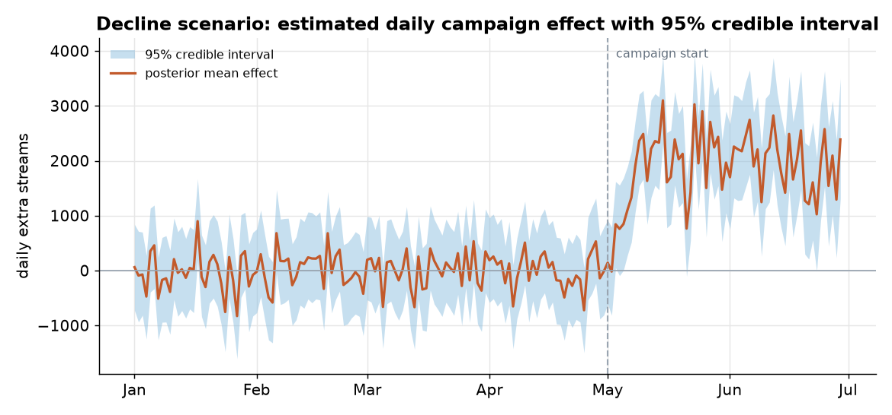

Estimated daily campaign effect over the post-period with its 95% credible interval and a zero reference line, near zero before the campaign and clearly positive after it.

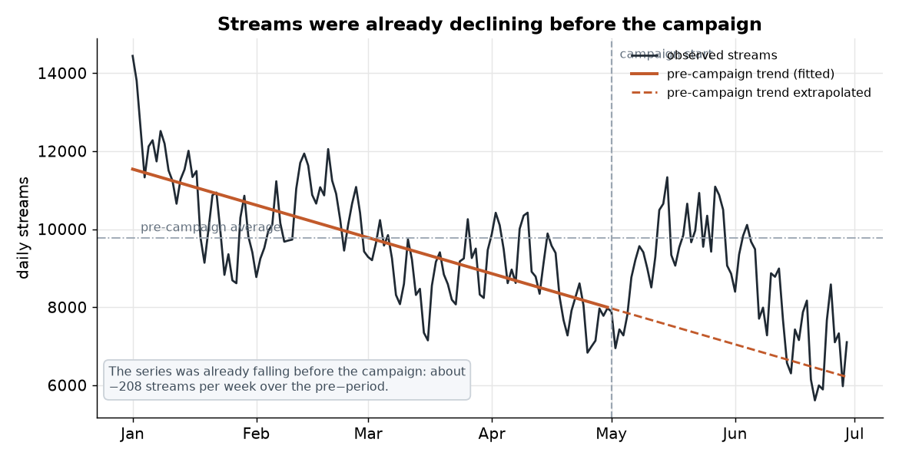

The observed series with its fitted pre-campaign trend: streams were already sliding before the campaign began, which is why the raw month-over-month drop is misleading.

### 3. Give me one regional total finance can trust.

The reconciled campaign total is 209,606 extra streams, and the per-region
figures now add up to it exactly. Estimated independently, the national model
said 217,768 and the sum of the five regions said 207,050, a contradiction of
about 10,718 streams that finance would have caught.

How: each region and the national aggregate get their own Bayesian counterfactual,
then MinT hierarchical reconciliation, weighted by each node's posterior variance,
projects the disagreeing estimates onto one coherent set. The reconciled total was
the most accurate of the three in this campaign, error −2,348 against the true
211,953, versus −4,904 bottom-up and +5,814 aggregate-only.

So what: hand finance a single total with per-region figures that reconcile to it,
and allocate the next budget by region without the numbers contradicting each
other.

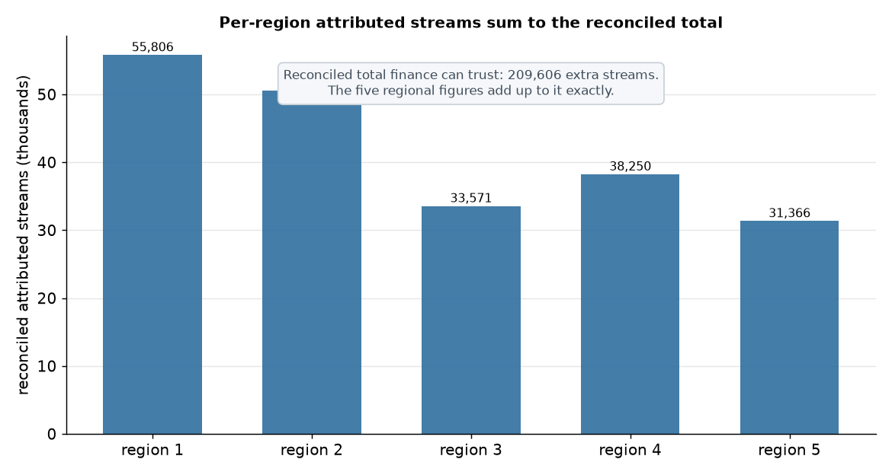

The per-region attributed streams shown as bars, adding up exactly to the single reconciled total finance can trust.

Behind these answers are three pieces documented below: a Bayesian forecasting
counterfactual that uses similar artists as donor regressors and models weekly
and day-of-year seasonality, a full Bayesian diagnostic suite that checks
convergence, fit, calibration, and robustness before any number is trusted, and a
hierarchical reconciliation step that makes the regional and total figures
coherent with proper uncertainty.

---

## Contents

- [How to run](#how-to-run)
- [The business question](#the-business-question)
- [Forecasting model](#forecasting-model)
- [Donor selection and the fanbase problem](#donor-selection-and-the-fanbase-problem)
- [Key results](#key-results)
- [How well does it work](#how-well-does-it-work)
- [Communicating results to clients](#communicating-results-to-clients)
- [Multi-region attribution and hierarchical reconciliation](#multi-region-attribution-and-hierarchical-reconciliation)
- [Cold start](#cold-start)
- [Privacy posture (GDPR and CCPA)](#privacy-posture-gdpr-and-ccpa)
- [Business impact](#business-impact)
- [Limitations](#limitations)
- [What a production version would add](#what-a-production-version-would-add)

## How to run

Create a virtual environment and install the requirements first.

```bash
python -m venv .venv
source .venv/bin/activate
pip install -r requirements.txt
```

The fastest way to see the work is the interactive explorer, which serves the
committed results with no build step:

```bash
sh demo.sh                          # serve docs/ on a free local port and open a browser
```

`demo.sh` picks a free port, serves `docs/` over `127.0.0.1`, opens the browser,
and waits until Ctrl-C. The explorer has seven scenario tabs, each with a clear
plain-language verdict, the forecast with its credible interval and attributed
area, the weekly and total numbers, and the Bayesian diagnostics.

To reproduce everything from fixed seeds (synthetic data, the fits, the report,
and every figure):

```bash
python scripts/run_demo.py
```

Runtime is about 14 minutes on a laptop CPU, most of it MCMC. Outputs are written
to `outputs/` and figures to `docs/images/`. MCMC is stochastic, so numbers move
slightly between runs, but the seeds in `configs/demo.yaml` and the reported
convergence keep them stable.

Individual stages can also be run on their own:

```bash
python scripts/generate_data.py      # regenerate the committed synthetic inputs
python scripts/run_montecarlo.py     # run the reconciliation Monte Carlo
python scripts/generate_figures.py   # redraw figures
python scripts/generate_explorer.py  # refit the seven explorer scenarios (docs/data/)
python scripts/generate_top_charts.py # redraw the three top-section charts
```

## The business question

A label runs a paid campaign for an artist. How much of the change in streams
did the campaign actually cause, and how much would have happened anyway because
the artist was already trending, a playlist added the track, or the whole market
was moving that week?

Getting this right decides how marketing budget is allocated, and it lets the
company tell an artist or a partner, in defensible numbers, what the campaign
did. The hard part is that there is no parallel universe where the same artist
did not get the campaign. We have to build that counterfactual.

## Forecasting model

The counterfactual is a forecast. We fit a Bayesian structural time-series model
to the pre-campaign window and project it through the post-campaign window. The
donor series (similar artists) keep moving through the post-period and are
unaffected by the campaign, so they carry the market signal into the forecast.
The causal effect is the observed series minus this predicted counterfactual,
reported pointwise, cumulatively, and as a relative lift, each with a full
posterior credible interval. This is the Bayesian-structural-time-series
counterfactual of Brodersen et al. (2015), implemented from scratch in PyMC.

Because the whole pipeline runs on aggregated daily series, a Bayesian model is
appropriate here. The privacy concern that would rule out a Bayesian user-level
model does not apply to aggregate counts (see the privacy section).

### Model structure

Fitted in standardized units, then transformed back to streams:

$$
y_t = \text{level}_t + \text{donors}_t \cdot \beta + \text{weekly}_t + \text{annual}_t + \text{noise}_t
$$

* Local level. $\text{level}_t$ is a Gaussian random walk, written non-centered as
  $\text{level}_t = \text{level}_0 + \sigma_{\text{level}} \sum_{s=1}^{t} \varepsilon_s$ with standard-Normal innovations $\varepsilon_s$. The market trend is carried
  mostly by the donors, and the local level absorbs the residual smooth drift.
  Its post-period forecast is flat from the last fitted level with uncertainty
  that grows like the square root of the horizon, which is where most of the
  counterfactual uncertainty comes from. A local linear trend is a drop-in
  extension when a series needs it.
* Donors as regressors. The donor control series enter as extra regressors with
  free coefficients. There is no convex sum-to-one constraint. This is a
  regression, not a synthetic-control weighting, which is the main departure from
  the classic method.
* Weekly seasonality. Fourier terms with period 7 (two harmonics).
* Annual seasonality. Fourier terms with period 365.25 (three harmonics),
  included only when there is enough history (see below).
* Observation noise. A half-Normal scale on the daily residual.

### Priors

* Donor coefficients: an adaptive-ridge Normal prior, $\beta \sim \text{Normal}(0, \tau)$
  with $\tau \sim \text{HalfNormal}$. This is the right match for a pool of pre-selected,
  co-moving, similar-scale donors, where several are expected to contribute
  moderately (a dense, not sparse, signal). The hierarchical scale $\tau$ lets the
  data set the amount of shrinkage, it is numerically stable for the sampler, and
  it keeps the coefficients from chasing pre-period noise. Laplace and the
  regularized horseshoe are available and are exercised in the prior-sensitivity
  check.
* Local-level innovation scale: $\sigma_{\text{level}} \sim \text{HalfNormal}(0.05)$, which keeps the
  level smooth so it does not absorb the campaign signal.
* Seasonal coefficients: weakly-informative Normal priors in standardized space.
* Observation noise: $\sigma \sim \text{HalfNormal}$.

### Seasonality and the day-of-year rule

Weekly seasonality is always modeled: 120 pre-campaign days span about 17 weeks,
which is plenty to identify a day-of-week pattern.

The annual, day-of-year component is added only when the pre-period spans at
least 365 days. With less than a full year the annual amplitude and phase are
confounded with the trend and the local level, so fitting them would be an
unsupported extrapolation. The demo shows both sides of this rule:

* The growth and decline scenarios have a 120-day pre-period, so the annual
  component is correctly omitted.
* A long-history scenario has a 430-day pre-period, so the annual component is
  included. It recovers the injected treated-specific annual cycle closely and
  the cumulative effect lands within 2.3% of the truth.

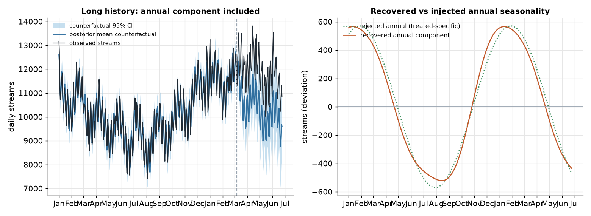

### Why similar-scale donors are still required

Even with free donor coefficients, donor hygiene matters. Every series is
standardized before the regression, which removes the raw level difference, but
scale is not only a level. A donor at a very different volume typically has a
different signal-to-noise ratio and different dynamics, so after standardizing it
contributes mostly noise, and its coefficient is unstable when projected into the
post-period. Keeping donors of similar scale and co-movement keeps the regressors
informative and the forecast trustworthy. Donor selection therefore uses a
two-stage filter: feature match, then a parallel-trends check.

## Donor selection and the fanbase problem

A forecast counterfactual is only as good as its donor pool, and the tempting
shortcut is the wrong one.

Campaigns target a specific region or audience. It is natural to reach for the
SAME artist in other, untargeted regions as a control. But when the campaign
targets the artist's existing fanbase, those other regions ARE the loyal base:
roughly flat, and not a model for how the TARGET audience would have moved
without the ad. Using them biases the estimate, usually toward understating the
effect, because the flat fanbase does not carry the trend the target audience
was on.

The figure below makes the point. The treated target audience (black) and the
selected donors (light blue) move together and trend upward. The same-artist
other-region series (red dashed) is flat and does not track them. In the demo its
pre-period level correlation with the target audience is 0.31, so it is correctly
rejected as a control.

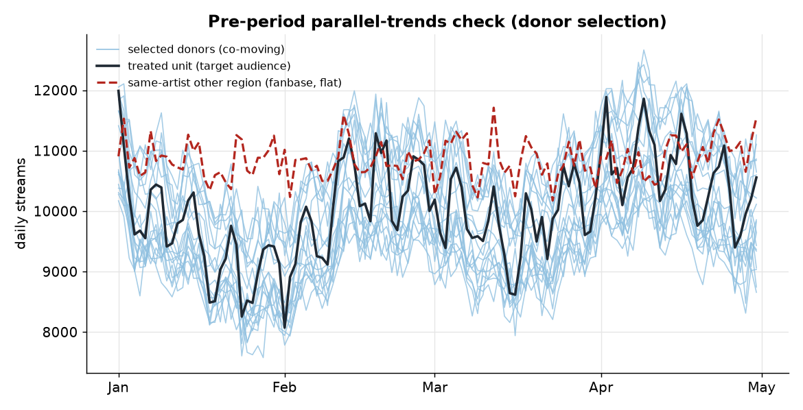

The pipeline assembles donors from SIMILAR artists and songs, then validates
them:

* Feature match: rank candidate artists or songs by similarity in a feature or
  embedding space (genre, tempo, audience demographics, catalog age, momentum),
  and keep the closest ones. At catalog scale this is a nearest-neighbor lookup
  over embeddings, cheap even for very large catalogs.
* Parallel-trends validation: of the feature-matched candidates, keep only those
  whose pre-period series actually moved together with the treated unit, measured
  by correlation on levels and on daily changes. Drop the rest.

In the demo this starts from 30 candidates (20 similar plus 10 unrelated) and
selects 19 of the 20 similar ones, with a minimum pre-period level correlation of
0.77 among those kept.

### Doing this at scale

The same pipeline scales to a catalog of hundreds of thousands of artists:
precompute an embedding per artist, pull nearest neighbors from an approximate
index, pre-filter by pre-period correlation on levels and daily changes, and fit
the Bayesian model on the survivors. The work is in donor hygiene (no
contamination from the campaign or spillover) and in automating and monitoring
the parallel-trends gate, but it is a standard, buildable pipeline.

## Key results

Two scenarios, each with a known injected effect so the estimate can be scored.

### Growth scenario

A stable or rising series that the campaign lifts further. Observed streams
(black) rise above the posterior mean counterfactual (blue), which tracks the
true counterfactual (green dotted) closely through the pre-period. The blue band
is the 95% credible interval and the shaded gap is the campaign effect.

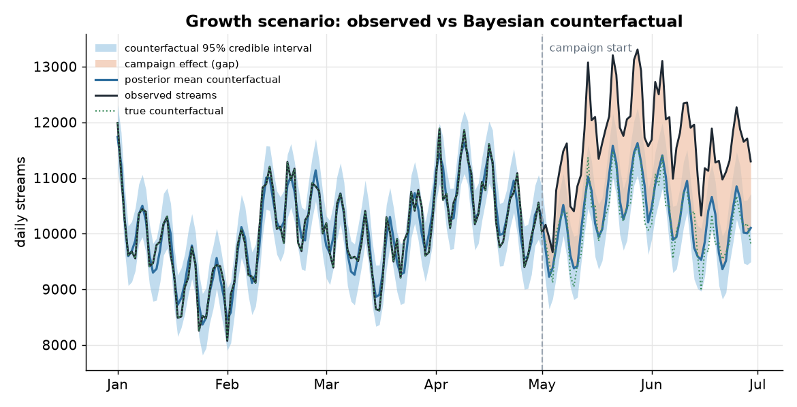

The pointwise effect hovers around zero through the pre-period, then lifts clearly
after the campaign starts, with the credible interval separating from zero.

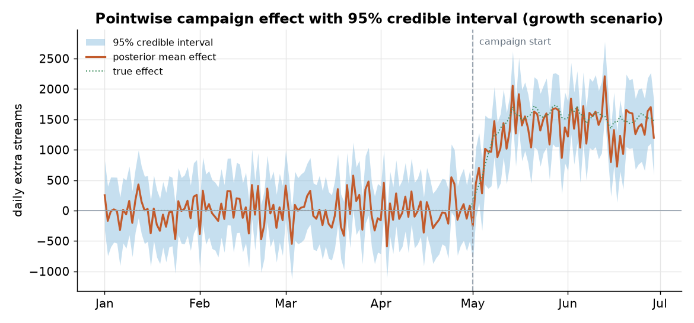

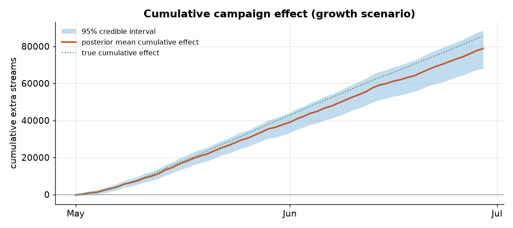

| quantity | estimate | 95% credible interval | ground truth |
|---|---|---|---|
| cumulative extra streams | 78,810 | 67,997 to 88,607 | 85,475 |
| relative lift | 12.7% | 10.8% to 14.5% | 13.9% |

Cumulative estimate within 7.8% of truth, and the true effect is inside the 95%
credible interval.

### Decline scenario

A series trending down, which is often exactly why a campaign is run. The
campaign makes the decline less steep but does not turn it positive.

| quantity | estimate | 95% credible interval | ground truth |
|---|---|---|---|
| cumulative extra streams | 112,858 | 83,829 to 143,499 | 106,183 |
| relative lift | 28.1% | 19.3% to 38.4% | 25.8% |

Cumulative estimate within 6.3% of truth, and the true effect is inside the 95%
credible interval.

Full numbers are in [outputs/attribution_report.md](outputs/attribution_report.md)
and [outputs/attribution_results.json](outputs/attribution_results.json).

## How well does it work

This section is for a technical, skeptical reader. Every figure and number is
regenerated by the demo from fixed seeds. MCMC is stochastic, so the numbers move
by small amounts between runs, but the seeds and the convergence checks keep them
stable.

### Recovery against the injected truth

Across the two headline scenarios the posterior mean recovers the true relative
lift to within about 1 to 2 percentage points (12.7% versus 13.9% for growth,
28.1% versus 25.8% for decline), and the injected cumulative effect falls inside
the 95% credible interval in both.

To go beyond two anecdotes, the demo runs a coverage study over 40 simulated
campaigns with randomized lift, trend, noise, and scale, each with a known
injected effect.

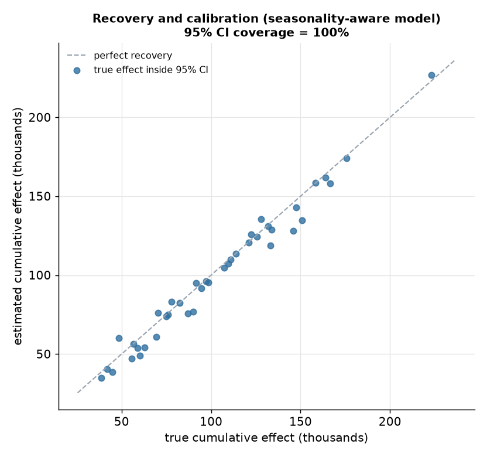

| model | 95% CI coverage | median abs error (cumulative) | mean rel-lift error | mean CI width |
|---|---|---|---|---|
| seasonality-aware | 100% | 3.4% | 1.2% | 35,474 |
| seasonality-blind | 100% | 4.6% | 1.4% | 52,960 |

The 95% credible interval contained the true cumulative effect in 40 of 40
campaigns. That is conservative rather than exactly nominal, which is the safe
direction: the intervals are never overconfident. The relative lift is recovered
to within 1.2% on average.

### Convergence diagnostics

The headline fits use 2 chains of 1,000 tuning and 1,000 draw iterations. On the
growth scenario the sampler reports max R-hat 1.010, minimum bulk effective
sample size about 550, 0 divergences out of 2,000 draws, and minimum BFMI 0.93.
The decline scenario is comparable at max R-hat 1.013 and 1 divergence. Across
all 80 fits in the coverage study the worst R-hat is 1.090 and there are 110
divergences in total, concentrated in the noisiest simulated campaigns.

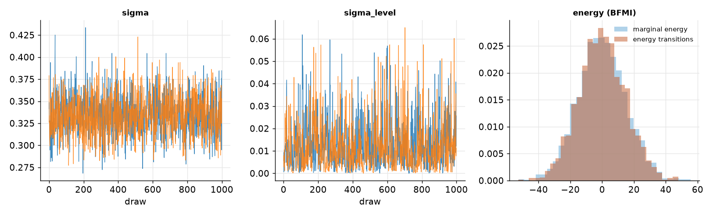

The trace plots for the noise scale and the level innovation scale mix well and
the two chains overlap. The energy plot shows the marginal energy and the energy
transitions with almost the same spread, which is what a healthy BFMI looks like.

### Prior and posterior predictive checks

The prior predictive spans a wide, plausible range of daily-stream paths around
the observed pre-period, confirming the priors are weakly informative rather than
forcing the answer. The posterior predictive tracks the observed pre-period
tightly, so the fitted model reproduces the data it was trained on.

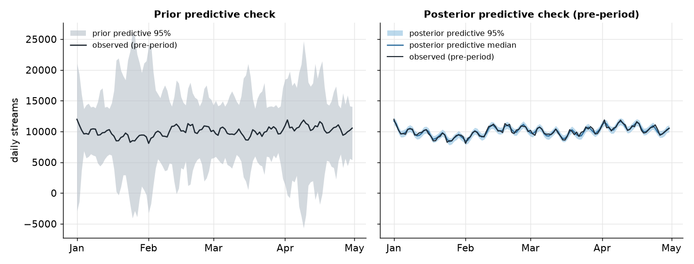

### Seasonality-aware versus seasonality-blind

Removing the seasonal components and letting the level and donors carry
everything is a common shortcut. The comparison runs both models on the same 40
campaigns.

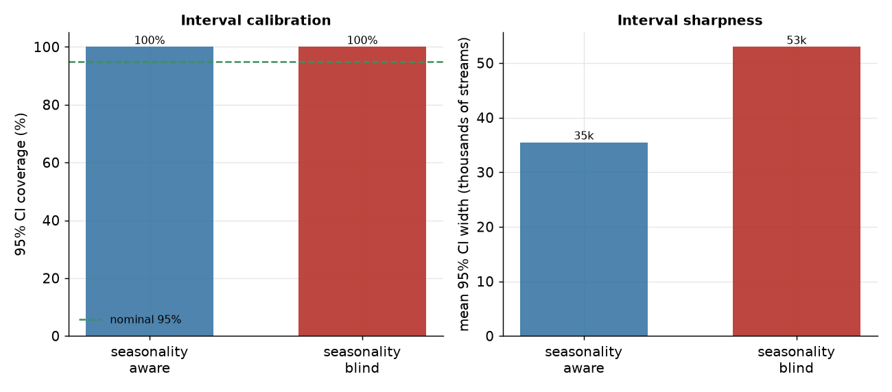

Both models keep the truth inside their intervals, but the seasonality-blind
model has to inflate its observation noise to absorb the unmodeled weekly
pattern, so its intervals are about 49% wider (mean width 52,960 versus 35,474)
and its point estimates are a little worse. The seasonality-aware model is the
sharper and more accurate one at the same coverage. The value of the day-of-year
component specifically is shown in the long-history scenario above, where the
model with enough history recovers the annual cycle it is given.

### Robustness to the donor-coefficient prior

Refitting the growth scenario under three donor-coefficient priors gives the same
answer, so the estimate is not an artifact of the prior choice.

| prior | cumulative effect | 95% credible interval | max R-hat | divergences |
|---|---|---|---|---|
| normal (adaptive ridge) | 78,810 | 67,997 to 88,607 | 1.010 | 0 |
| laplace | 78,996 | 68,613 to 89,036 | 1.008 | 0 |
| horseshoe | 78,997 | 68,677 to 88,898 | 1.011 | 46 |

The point estimate moves by less than 200 streams across priors. The horseshoe
produces the expected funnel divergences and is the least comfortable to sample,
which is one reason the adaptive-ridge Normal is the default.

### Known limitations

* Coverage is conservative here (100% over 40 campaigns), meaning the intervals
  are a little wider than strictly necessary. That is the safe error to make for
  a defensible number, but it is not perfectly calibrated to 95%.
* Synthetic donors co-move with the treated unit by construction, so the model
  has an easier job than on messy real data, where contamination and structural
  breaks are the real risks.
* With a short pre-period the annual component cannot be fitted, so a campaign
  whose post-window overlaps a strong, unmodeled annual swing would be biased.
  The inclusion rule is the guard, and the safe move is to widen intervals or
  defer when history is thin.
* Effects are modeled as a single clean intervention. Overlapping campaigns or
  effects that decay and rebound would need a richer effect model.

## Communicating results to clients

This is where attribution most often goes wrong, and it is a communication
problem, not a modeling one.

The common real situation: streams were already declining, so the client ran an
ad. The ad helped, but the observed streams are still below last month. The
client looks at the month-over-month drop and concludes the campaign failed.

The correct causal read is the opposite. Versus the counterfactual of no ad, the
series is materially higher. The right frame is streams retained, or decline
avoided, not raw growth.

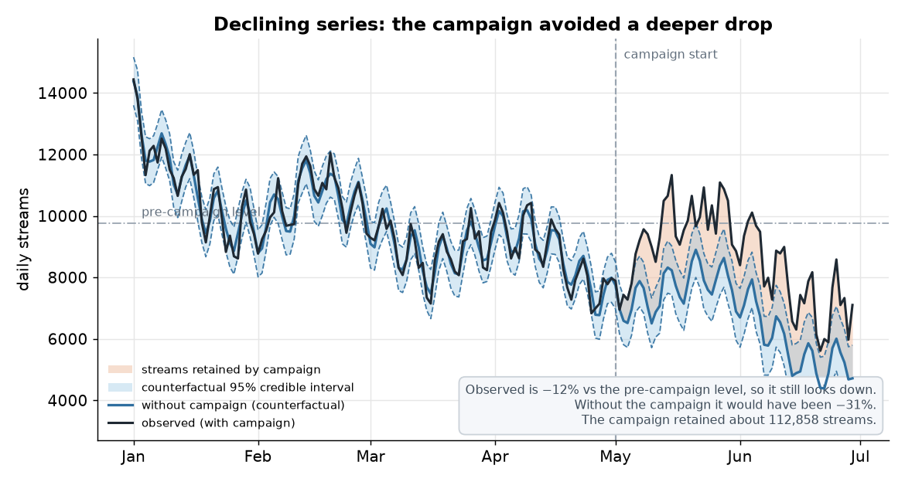

In the demo, observed streams end the post-period about 11.7% below the
pre-campaign level, so at a glance the campaign looks like a failure. Without the
campaign the series would have been about 31.0% below. The campaign retained about
110K streams. That is the number to lead with.

Do:

* Set expectations before the campaign. If the baseline is declining, say so up
  front, and agree that success means beating the no-ad counterfactual, not
  beating last month.
* Show the counterfactual next to the observed series, and lead with that
  comparison.
* Quantify avoided losses in plain language, with the credible interval attached.

Do not:

* Do not claim raw growth when the series declined.
* Do not hide the month-over-month drop. Acknowledge it, then reframe it.
* Do not present a single point estimate with no uncertainty.

## Multi-region attribution and hierarchical reconciliation

A campaign often runs across several regions, and stakeholders want both the
per-region effects and one overall number. Estimating each node on its own is
incoherent: the independent per-region effects do not sum to the independent
aggregate effect, because they are separate estimates from different donor pools
with different fit quality.

The design choice here is to run MinT reconciliation on top of the per-node
Bayesian estimates, rather than building one joint hierarchical model over all
regions at once. A single joint model is a natural fit but far heavier to fit and
to check, and it would not change the headline message. Reconciling the separate
estimates this way is also transparent about uncertainty, because the weight matrix is
built from the posterior variance of each node's effect, a principled model-based
variance.

How the hierarchy works under the hood. The regions and the total form a small
tree: the total on top, the five regions as the leaves, tied together by one
accounting identity: the regional effects have to add up to the total effect.
That identity is written as a summing matrix $S$, which just encodes total equals
sum of regions. Fitting every node on its own gives a base estimate for each
region and for the total, but nothing makes those numbers obey the identity, so
they arrive incoherent.

Reconciliation restores the identity. It looks for the single coherent set of
regional effects, ones that do sum to a matching total, that stays as close as
possible to the base estimates, where close is measured in units of each
estimate's own uncertainty. A region whose Bayesian fit is sharp, small posterior
variance from good donors and a clean pre-period, is trusted and barely moved. A
region whose fit is noisy, few donors or a wobbly pre-period, is allowed to move
more so the hierarchy can be made consistent. The total and the regions are
adjusted together until they agree, and because the adjustment is a weighted
least-squares projection the uncertainty carries through to the reconciled
numbers instead of being thrown away.

Read through a Bayesian lens this is just the constrained posterior. If the
per-node posteriors are summarized as Gaussians, reconciliation returns the
posterior mean under the linear constraint that the regions sum to the total,
using each node's posterior variance as its weight. So the hierarchical step is
not a separate philosophy bolted onto the forecasts, it is the same posterior
information projected onto the one set of numbers that is internally consistent.

Concretely, optimal (MinT) reconciliation, Wickramasuriya, Athanasopoulos and
Hyndman (2019), carries out this projection:

$$
\text{reconciled\_bottom} = (S^\top W^{-1} S)^{-1} S^\top W^{-1} \, \text{base\_all}
$$

$$
\text{reconciled\_all} = S \, \text{reconciled\_bottom}
$$

with $S$ the summing matrix and $W$ the diagonal of per-node posterior variances.
The reconciled per-region effects sum to the reconciled total by construction, and
$W$ downweights the noisy donor-poor regions.

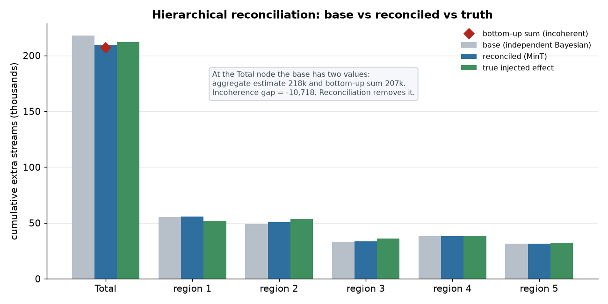

In the illustrative campaign (true total 211,953):

| method | total estimate | error vs true total |
|---|---|---|
| bottom-up | 207,050 | −4,904 |
| aggregate-only | 217,768 | +5,814 |
| reconciled (MinT) | 209,606 | −2,348 |

The independent aggregate and the bottom-up sum disagree by about 10,718 streams,
and reconciliation is the most accurate of the three while being coherent by
construction.

One campaign is anecdote, so the demo runs a Monte Carlo over 12 simulated
multi-region campaigns at a fixed master seed, with heterogeneous region volumes,
lifts, donor availability, and donor quality.

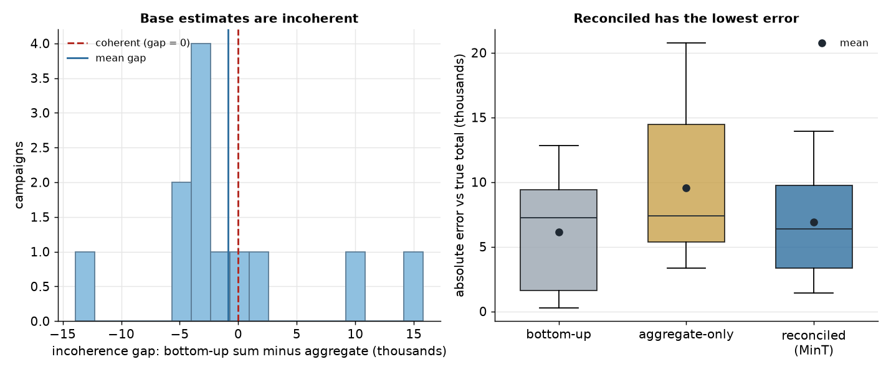

| method | mean absolute error vs true total |
|---|---|
| bottom-up | 6,158 |
| aggregate-only | 9,557 |
| reconciled (MinT) | 6,926 |

Across these campaigns the base estimates are incoherent by a standard deviation
of about 7,600 streams. Reconciliation clearly beats the aggregate-only baseline
and is comparable to the bottom-up sum, while being the only method that uses both
levels and returns a coherent hierarchy. On a larger Monte Carlo, and with a full
non-diagonal `W` that captures cross-region error correlation, the reconciliation
advantage widens. These numbers come from
[outputs/reconciliation_montecarlo.json](outputs/reconciliation_montecarlo.json).

## Cold start

The Bayesian forecast has two hard prerequisites: a pre-campaign period for the
treated unit, long enough to fit the model and validate parallel trends, and a
pool of similar donors that actually co-move with it before the campaign. Cold
start is when one or both do not exist yet.

* A brand-new artist or debut single with little pre-campaign history. There is
  nothing to fit the forecast on and nothing to validate against, so the
  counterfactual would be an extrapolation with no evidence behind it. The
  posterior predictive check and the parallel-trends correlations are exactly
  what is missing, which is the tell that a result is cold start.
* No suitable donors. A genuinely novel artist with no close comparables leaves
  the donor pool empty or full of units that do not co-move, which the
  parallel-trends filter rejects and the posterior predictive check flags.

Mitigations:

* Minimum-history gate. Only run attribution once enough clean pre-period has
  accrued to fit the model and pass the parallel-trends check. The annual-component
  inclusion rule is the same idea applied to seasonality: model only what the
  history can support, and widen intervals or defer otherwise.
* Borrow structure. For a new song by an established artist, use the artist's own
  catalog as donors. When artist-level history is thin, put the artist in a
  hierarchy under a genre or cohort total and let the reconciliation machinery pull
  the thin, noisy artist estimate toward the better-measured cohort.
* Randomized geo holdout, the gold standard. When observational donors are
  unavailable or untrustworthy, do not fit a counterfactual at all. Run the
  campaign in a treated group and hold out a randomized control group, and read the
  effect as the difference. The per-region and total structure maps directly onto
  the same hierarchy and reconciliation used here.
* Flag cold-start attributions as lower confidence, with deliberately wider
  intervals, so stakeholders read a thin-history result with appropriate caution.

## Privacy posture (GDPR and CCPA)

The entire pipeline runs on aggregated daily time series. There is no
individual-level data at any stage:

* Inputs are per-unit per-day stream totals. No user identifiers, no device data,
  no per-listener records.
* The donor pool is other artists' aggregated series, not other users.
* Every output is an artist-level or region-level aggregate.

Because no personal data is processed, the method sidesteps the core GDPR and
CCPA obligations that attach to personal data. This is also why a Bayesian model
is appropriate here: the privacy problem that would attach to a user-level
Bayesian model does not exist for aggregate counts, where the posterior is over
population-level quantities only.

## Business impact

* Turns "the campaign seemed to work" into a defensible number with a posterior
  credible interval and a full diagnostic trail attached.
* Handles the hard and common case of a declining baseline, where raw
  month-over-month numbers mislead and a counterfactual is the only fair read.
* Gives account teams a clear, defensible script for client conversations.
* Scales to a large catalog through embedding-based donor matching plus an
  explicit parallel-trends check.
* The privacy-by-aggregation design keeps the whole approach inside GDPR and CCPA
  constraints.

## Limitations

* Synthetic data. Donors are generated to co-move with the treated unit, so the
  model has an easier job here than on messy real data. Real donor pools need care
  to avoid contamination.
* The regression assumes the similarity match returns donors at comparable
  streaming volume, which is why donor selection keeps a scale and co-movement
  filter even though the coefficients are free.
* Single clean intervention. Overlapping campaigns or decaying-and-rebounding
  effects would need a richer effect model.
* The multi-region reconciliation uses a diagonal weight matrix from posterior
  variances. A full covariance across regions would reconcile better.
* Coverage is conservative rather than exactly nominal, and the multi-region Monte
  Carlo is small (12 campaigns) for runtime.

## What a production version would add

* Automated donor-pool construction from a catalog embedding index, with
  contamination checks and a monitored parallel-trends gate.
* Followers as a second outcome alongside streams, and a richer effect model for
  overlapping campaigns.
* A full, non-diagonal MinT covariance estimated across regions, and deeper
  hierarchies (region within country within total) reconciled in one pass.
* A larger calibration study across many past campaigns to confirm interval
  coverage, plus scheduled refits and drift monitoring on donor quality.
* An account-facing report template that leads with the counterfactual and the
  decline-avoided framing.
